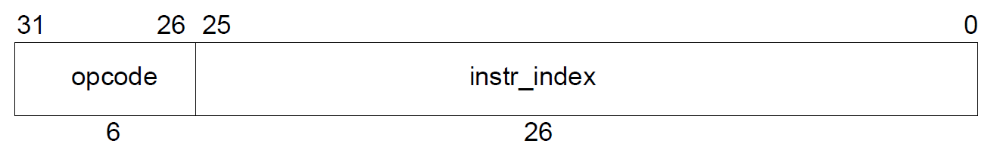
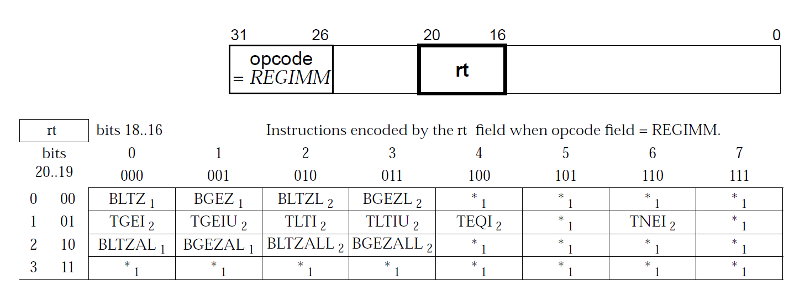

# 基于***MIPS IV***架构的二进制编码与汇编指令转换器实现

## 项目背景

计算机体系结构课程课后实验选题之一，目的是通过MIPS32手册中的***MIPS IV***架构来实现一个二进制编码与汇编指令的转换器，深化我们对指令系统编码知识的了解和掌握.  

## 项目原理
### 前置知识

#### 指令分类

计算机中指令按格式可以分为以下三类指令：

1. I类指令
   
   <center> 图1</center>
   
2. J类指令
   
   <center> 图2</center>
   
3. R类指令
   
   <center> 图3</center>

#### ***MIPS32***寄存器  
   
   <center> 图4</center>  
   
#### ***MIPS IV***架构指令信息表
   
   <center> 图5</center>
   
   
   <center> 图6</center>
   
   
   <center> 图7</center>
   
### 编码规则

对于一个汇编指令，按照如下步骤对其编码生成对应的32位二进制编码，下面以汇编指令SLL $t0, $s3, 3举例说明：

1. 根据汇编指令中的第一个字段即指令名来确定该指令属于哪一类指令，SLL属于R类指令.

2. 通过图3获取该指令类别对应的指令格式，对比MIPS32体系结构中获得对应字段所占字节值，SLL指令格式为SLL rd， rt， sa，则rd字段值为t0，rt字段值为s3，sa字段值为3，剩余没用到的字段rs值统一默认为0.
并且根据上述图4将t0和s3转换成对应的序号值.
    
3. 将各字段的值按照R类格式指令顺序拼接起来，并转换成32位二进制编码，如下图所示：
   
   <center> 图8</center>

### 解码规则

对于给定的32位二进制编码，采用如下解码步骤对其解码生成对应的汇编指令，0000_0000_0001_0011_0100_0000_1100_0000举例说明：

1. 首先提取出上述二进制编码中的前六位作为指令操作码字段的值，从而确定对应的指令名，当操作码字段的值为0或1时，查找其他对应字段来确定对应的指令名.上述指令操作码字段为0，再提取后六位作为function字段的值，确定指令名为SLL.

2. 通过指令名获取对应的指令格式，对比指令格式表为指令格式中的字段赋值.SLL指令格式为SLL rd， rt， sa，对比图3为rd，rt和sa字段赋值，得到SLL 8,19,3

## 设计

### 项目架构

本项目可由两个数据获取和数据格式转换两个应用场景组成.

### 数据获取

如项目原理所述，要完成对二进制编码与汇编指令转换器的实现需要三类指令格式，每个指令对应的指令格式，指令格式中不同字段的信息等***MIPS IV***架构信息，为了方便测试，采用穷举的方式生成测试数据.本项目通过下图所示方法获取所需信息并存储到对应文件上：

<center> 图9</center>

### 数据格式转换

得到***MIPS IV***架构信息后，在***main.py***中对这些信息进行整合，实现不同信息之间的映射，并通过读入所有测试数据进行测试，来完成进制编码与汇编指令间两种数据格式的相互转换.


<center> 图10</center>

### 项目组件

本项目由***main.py***，***get_table.py***和***hexTolnst.js***三个运行代码组成，可分为两个应用场景，分别是利用***get_table.py***和***hexTolnst.js***两个代码完成数据获取，
以及调用***main.py***进行数据格式转换和数据测试.

### 设计原则

遵循***MIPS IV***架构下对32位指令进行编码以及解码的规则，将数据从引擎中独立出来，充分满足安全性和简洁性；代码编写满足可测试性及可维护性.  

### 文件说明

***get_table.py***是用来从网页[http://mipsconverter.com/opcodes.html] 上获取MIPS Opcode Reference信息并将其存储到***table_data.xlsx***文件中.  
***hexToInst.js*** 是用来生成二进制编码与其对应的汇编指令的测试数据的，其测试数据格式为每行分别为一个二进制编码和对应的汇编指令，生成的测试数据存储到***test_data.txt***.  
***MIPS_manunal.xlsx***是通过Adobe ACrboat软件将***mips isa.pdf***中MIPS IV Architecture这个表格信息提取出来并存储到它这里.  

## 实现

### 编程语言及工具

本项目使用了Python和Js语言构建运行代码，使用Adobe ACrboat软件进行pdf中表格提取.

### 代码详解

load_MIPS32_manual函数将有关的MIPS信息通过pandas读取MIPS_manunal.xlsx，table_data.xlsx文件内容整合起来，从而获得每个汇编指令信息间的映射关系.

```python
def load_MIPS32_manual():
    opcode_table = pd.read_excel(f'D:\学习资料\课程学习\计算机体系结构\mips\MIPS_encode_decode\MIPS_manunal.xlsx', sheet_name='opcode',
                                 header=None)
    function_table = pd.read_excel(f'D:\学习资料\课程学习\计算机体系结构\mips\MIPS_encode_decode\MIPS_manunal.xlsx',
                                   sheet_name='function', header=None)
    rt_table = pd.read_excel(f'D:\学习资料\课程学习\计算机体系结构\mips\MIPS_encode_decode\MIPS_manunal.xlsx', sheet_name='rt',
                             header=None)
    Institution_format_table = pd.read_excel(f'D:\学习资料\课程学习\计算机体系结构\mips\MIPS_encode_decode\\table_data.xlsx',
                                             dtype=str)
    Institution_format_table = Institution_format_table.fillna("empty")
    Institution_format_table.replace({'imm': 'offset'}, inplace=True)
    Institution_name, Register_dict, Register_idx_dict, Institution_information = {}, {}, {}, {}

    for idx, row in Institution_format_table.iterrows():
        row[0] = row[0].replace('(', ' ')
        row[0] = row[0].replace(')', ' ')
        row[0] = row[0].replace(',', ' ')
        one_institution_format = row[0].split()
        name = one_institution_format[0]
        Institution_information[name] = {}
        Institution_information[name]['opcode'] = row[3]
        for va in row:
            if va == "empty":
                break
            Institution_information[name]['func'] = va
        if len(one_institution_format) >= 2:
            Institution_information[name]['format'] = [i for i in one_institution_format[1:]]
        else:
            Institution_information[name]['format'] = []
    Register_dict[0] = str('zero')
    Register_dict[1] = str('at')
    Register_dict[2] = str('v0')
    Register_dict[3] = str('v1')
    for idx in range(4, 7, 1):
        Register_dict[idx] = str('a') + str(int(idx - 4))
    for idx in range(8, 15, 1):
        Register_dict[idx] = str('t') + str(int(idx - 8))
    for idx in range(16, 23, 1):
        Register_dict[idx] = str('s') + str(int(idx - 16))
    Register_dict[24] = str('t8')
    Register_dict[25] = str('t9')
    Register_dict[26] = str('k0')
    Register_dict[27] = str('k1')
    Register_dict[28] = str('gp')
    Register_dict[29] = str('sp')
    Register_dict[30] = str('fp')
    Register_dict[31] = str('ra')
    for ke, va in Register_dict.items():
        Register_idx_dict[va] = ke
    return opcode_table, function_table, rt_table, Register_dict, Register_idx_dict, Institution_information
```

Hex_to_Institution函数实现了从十六进制编码到汇编指令的转换

```python
def Hex_to_Institution(input, opcode_table, function_table, rt_table, Register_dict, Intitution_formation, tp):
    binary = Hex_to_bin(int(input[2:], 16), 32)
    opcode = int(binary[:6], 2)
    Institution, rs, rt, rd, sa, function, offset = str(''), 0, 0, 0, 0, 0, 0
    if opcode == 0:#R-Type Institution
        rs, rt, rd, sa, function = int(binary[6:11], 2), int(binary[11:16], 2), int(binary[16:21], 2), str(int(binary[21:26], 2)), int(binary[-6:], 2)
        institution_name = str(function_table[function % int(2 ** 3)][int(function / int(2 ** 3))])
        if tp == 'name':
            rs, rt, rd = Register_dict[rs], Register_dict[rt], Register_dict[rd]
        else:
            rs, rt, rd = str(rs), str(rt), str(rd)
    elif opcode == 1:
        rs, rt, offset = int(binary[6:11], 2), int(binary[11:16], 2), str(int(binary[16:], 2))
        institution_name = str(rt_table[rt % int(2 ** 2)][int(rt / int(2 ** 3))])
        if tp == 'name':
            rs, rt = Register_dict[rs], Register_dict[rt]
        else:
            rs, rt = str(rs), str(rt)
    else :
        institution_name = str(opcode_table[opcode % int(2 ** 3)][int(opcode / int(2 ** 3))])
        if institution_name == 'J' or institution_name == 'JAL':
            offset = Hex_to_bin(int(binary[6:], 2), 26)
        else:
            rs, rt, offset = int(binary[6:11], 2), int(binary[11:16], 2), Hex_to_bin(int(binary[16:], 2), 16)
            if tp == 'name':
                rs, rt = Register_dict[rs], Register_dict[rt]
            else:
                rs, rt = str(rs), str(rt)
    Institution = Institution + institution_name
    formats = Intitution_formation[institution_name]['format']
    Institution = match_institution_format(formats, Institution, rs, rt, rd, sa, function, offset)
    return Institution
```

Institution_to_Hex函数实现了从汇编指令到对应二进制编码.汇编指令按寻址方式不同使用的字段也不尽相同，默认未使用的字段所占字节为0.

```python
def Institution_to_Hex(input, Institution_formation, Register_idx_dict, tp):
    tl_institution = input.split()
    institution_name = tl_institution[0]
    Hex, formats = str(''), [tl_institution[idx].replace(',', '') for idx in range(1, len(tl_institution), 1)]
    formats = [i.replace('$', '') for i in formats]
    if tp == 'name':
        name_to_idx = lambda f: [str(Register_idx_dict[x]) if i != len(f) - 1 else x for i, x in enumerate(f)]
        formats = name_to_idx(formats)
    opcode = Institution_formation[institution_name]['opcode']
    if institution_name == 'J' or institution_name == 'JAL':
        instr_index = Hex_to_bin(int(tl_institution[1], 16), 26)
        Hex = Hex + opcode + instr_index
    elif str('offset') in Institution_formation[institution_name]['format']:
        rs, rt = str('00000'), str('000000')
        for idx in range(len(formats)):
            va = Institution_formation[institution_name]['format'][idx]
            if va == 'rt':
                rt = Hex_to_bin(int(formats[idx]), 5)
            elif va == 'rs':
                rs = Hex_to_bin(int(formats[idx]), 5)
            else:
                offset = Hex_to_bin(int(formats[idx]), 16)
        Hex = Hex + opcode + rs + rt + offset
    else:
        rs, rt, rd, sa = [str('00000') for _ in range(4)]
        func = Institution_information[institution_name]['func']
        for idx in range(len(formats)):
            va = Institution_formation[institution_name]['format'][idx]
            if va == 'rt':
                rt = Hex_to_bin(int(formats[idx]), 5)
            elif va == 'rs':
                rs = Hex_to_bin(int(formats[idx]), 5)
            elif va == 'rd':
                rd = Hex_to_bin(int(formats[idx]), 5)
            else:
                sa = Hex_to_bin(int(formats[idx]), 5)
        Hex = Hex + opcode + rs + rt + rd + sa + func
    return Hex
```

test_Hex_to_Institution函数用于检验实现的十六进制编码转汇编指令的正确性.  

```python
def test_Hex_to_Institution(own, std):
    if len(own) != len(std):
        print('error')
    for idx in range(len(own) - 1):
        own[idx] = own[idx].replace(',', '')
        if own[idx] != std[idx]:
            print(f'{result} {std_institution}')
```

下面两个函数共同实现了检验汇编指令转对应二进制编码的正确性.由于指令有多种寻址方式，这导致了哪怕同属一类的指令再格式上也有所不同，
从而造成了某些字段所占字节未被使用，导致了同一汇编指令会对应多种不同的二进制编码.想要比对汇编指令转对应二进制编码的正确性，
需要按照汇编指令格式各字段提取对应的二进制串，对比提取后的二进制编码是否相同来验证正确性.

```python
def extract_format(binary, institution_name, formats):
    extract_binary = binary[:6]
    for idx in range(1, len(formats), 1):
        if formats[idx] == 'rs':
            extract_binary = extract_binary + binary[6:11]
        elif formats[idx] == 'rt':
            extract_binary = extract_binary + binary[11:16]
        elif formats[idx] == 'rd':
            extract_binary = extract_binary + binary[16:21]
        elif formats[idx] == 'sa':
            extract_binary = extract_binary + binary[21:26]
        elif formats[idx] == 'offset':
            if institution_name == 'J' or institution_name == 'JAL':
                extract_binary = extract_binary + binary[6:]
            else:
                extract_binary = extract_binary + binary[16:]
    return extract_binary


def test_Institution_to_Hex(own, std, institution_name, Institution_information):
    ow = extract_format(own, institution_name, Institution_information[institution_name]['format'])
    st = extract_format(std, institution_name, Institution_information[institution_name]['format'])
    if ow != st:
        print(f'{ow} {st} {institution_name}')
```

## 测试

本项目通过穷举的方式枚举***MIPS32***指令系统下所有可能的二进制编码，并通过***hexToInst.js***传入二进制编码，
生成所有二进制编码与对应的汇编指令并存储在***test_data.txt***中，再通过调用***main.py***读取***test_data.txt***来完成测试.

## 参考资料
MIPS32信息手册：***mips-isa.pdf***，MIPS Encoding and Decoding Instructions网页：[https://marz.utk.edu/my-courses/cosc130/lectures/encoding-and-decoding-instructions/#:~:text=MIPS%20Encoding%20and%20Decoding%20Instructions%201%20Learning%20Objectives,...%206%20Limitations%20for%20Jump%20and%20Branch%20]

