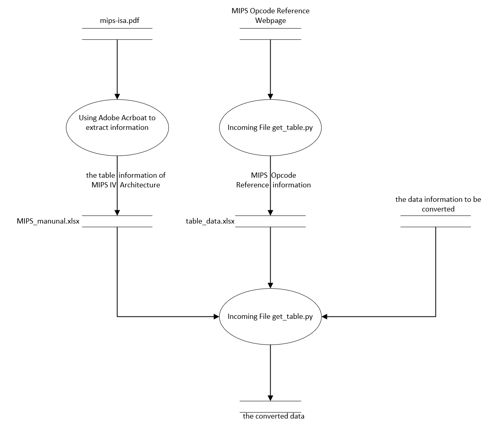

# Computer Architecture Experiment
## Project background
This project achieved Instruction encode and decode based on MIPS32 manual.  
It implements the mutual conversion between assembly instructions and binary encoding.  
## Project File Function Description
The ***get_table.py*** is used to Crawling MIPS Opcode Reference information from web pages[http://mipsconverter.com/opcodes.html] to generate ***table_data.xlsx***.  
The ***hexToInst.js*** is used to generate test data for binary encoding and corresponding assembly instruction representations through the MIPS32 binary and assembly instruction converter on the webpage[http://mipsconverter.com/instruction.html] and generate ***test_data.txt*** for tesing.  
The ***MIPS_manunal.xlsx*** is generated by Adobe ACrboat's PDF extraction function, which extracts the table information of MIPS IV Architecture from ***mips isa.pdf*** into Excel.  
## Get Started
#### Requirements and Installation
Python >= 3.6  
Pandas  == 1.1.5  
Requests == 2.27.1  
Beautifulsoup4 == 4.10.0   
Nodejs == 20.12.0

1. Python environment (Optional): We recommend using Conda package manager
    ```python
    pip install python==3.6
    ```
2. Install Pandas:
    ```python
    pip install pandas==1.1.5
    ```
3. Install Requests
    ```python
    pip install requests==2.27.1
    ```
4. Install Beautifulsoup4
    ```python
    pip install beautifulsoup4==4.10.0   
    ```
5. Install Nodejs  
    安装链接如下:[https://nodejs.cn/download/]

## Usage
Running ***get_table.py*** to get ***table_data.xlsx***:  
```python
python get_table.py
```
Running ***hexToInst.js*** to generate ***test_data.txt***:
```javascript
node hexToInst.js
```
Obtain data through the above command.Use main.py to receive the data obtained above for data format conversion:
```python
python main.py --input  --type bintoins --format number
```
usage: main.py [-h] [--type MODEL] [--format number]
optional arguments:  
```--help```show this help message and exit  
```--type```show the type of this convert data  
```--format```show the format of data corresponding registers 
## Note:  
We specify that the assembly instruction format follows the assembly representation definition.  
eg.add $s1,$t0,$s4 or add $17,$8,$20.  

The data flow diagram of this project is shown below:
